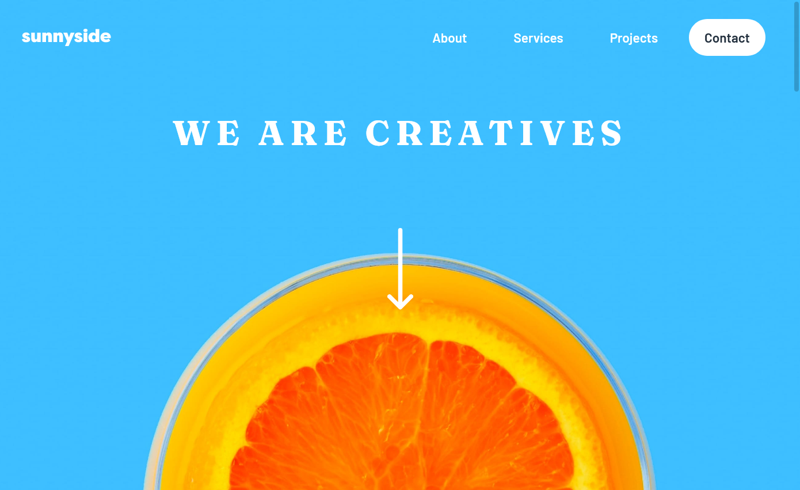
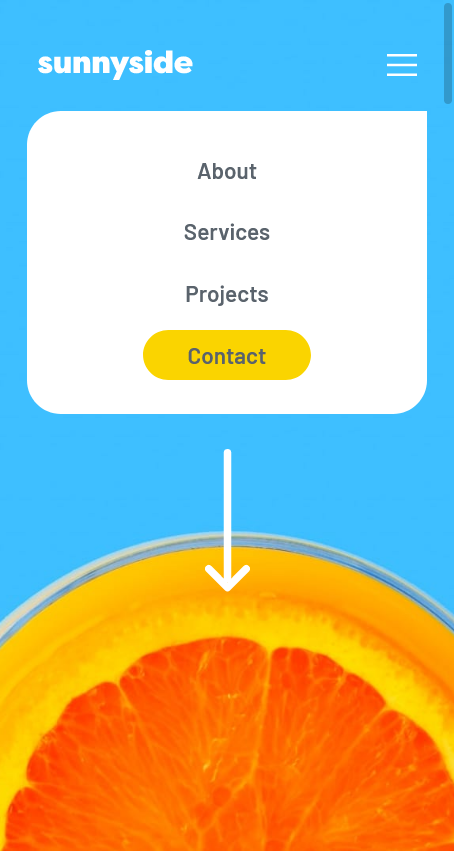
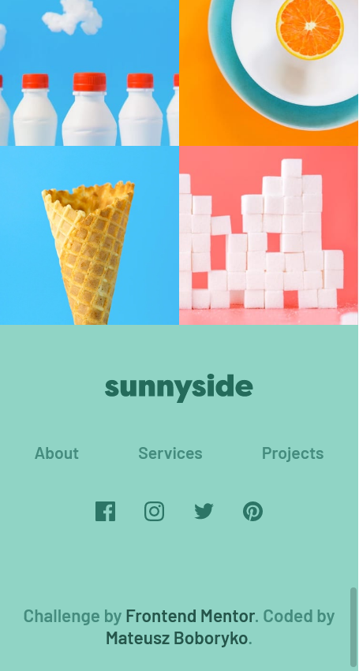

# Frontend Mentor - Sunnyside agency landing page solution

This is a solution to the [Sunnyside agency landing page challenge on Frontend Mentor](https://www.frontendmentor.io/challenges/sunnyside-agency-landing-page-7yVs3B6ef). Frontend Mentor challenges help improve my coding skills by building realistic projects.

## Table of contents

- [Overview](#overview)
  - [The challenge](#the-challenge)
  - [Screenshot](#screenshot)
  - [Links](#links)
  - [Built with](#built-with)
- [Author](#author)

## Overview

### The challenge

Users should be able to:

- View the optimal layout for the site depending on their device's screen size
- See hover states for all interactive elements on the page

### Screenshot

### Links

- Solution URL: [GitHub Repo](https://github.com/M4thez/sunnyside-landing-page)
- Live Site URL: [GitHub Pages](https://m4thez.github.io/sunnyside-landing-page/)

### Built with

- Semantic HTML5 markup
- SCSS - CSS preprocessor
- Flexbox

## Author

- Website - [Mateusz Boboryko](https://m4thez.github.io)
- GitHub - [@M4thez](https://github.com/M4thez)
